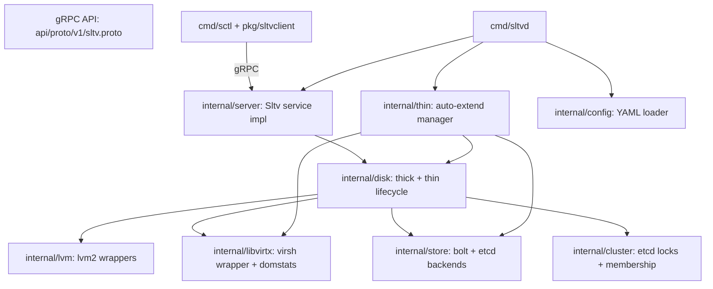
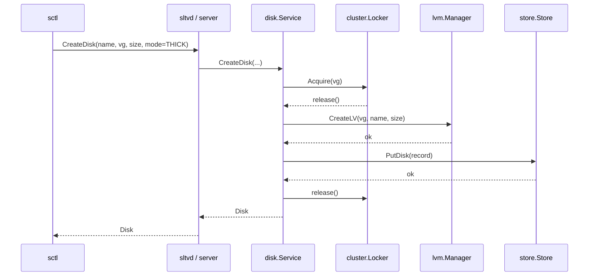
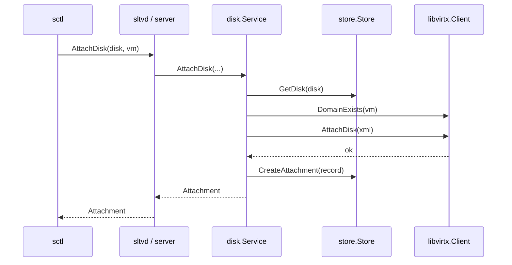

# Architecture

This document describes how the SLTV daemon (`sltvd`) and CLI
(`sctl`) are put together. It is the companion of
[docs/configuration.md](configuration.md),
[docs/clustering.md](clustering.md), and
[docs/thin-provisioning.md](thin-provisioning.md).

## Component overview

| Package | Responsibility |
| --- | --- |
| `internal/config` | Load YAML, env overrides, validation, defaults. |
| `internal/lvm` | Wrap `lvs`, `vgs`, `lvcreate`, `lvextend`, `lvremove` behind a `Runner` interface so they can be faked in tests. |
| `internal/libvirtx` | Wrap `virsh attach-device`, `detach-device`, `blockresize`, `domstats` and parse the output. Faked via `FakeClient` in tests. |
| `internal/store` | `Store` interface with three implementations: `MemoryStore` (tests), `BoltStore` (standalone persistence), `EtcdStore` (cluster mode). |
| `internal/cluster` | ETCD client wiring, session/lease, membership heartbeat, distributed lock per VG. `NoopLocker` is used in standalone mode. |
| `internal/disk` | The product logic. Orchestrates `lvm`, `libvirtx`, `store`, and the locker for create/delete/attach/detach/extend on both thick and thin disks. |
| `internal/thin` | Background goroutine that drives `domstats` polling and triggers `disk.ExtendByPercent`. |
| `internal/server` | gRPC service implementation; turns proto requests into calls on `disk.Service` and `lvm.Manager`. |
| `cmd/sltvd` | Wires everything together, manages signals, writes structured logs. |
| `cmd/sctl` + `pkg/sltvclient` | Cobra-based CLI plus a reusable Go client for embedding in other programs. |

The packages are layered: `disk` only depends on `lvm`, `libvirtx`,
`store`, and `cluster`; `server` only depends on `disk` and `lvm`;
`thin` depends on `disk`, `store`, `libvirtx`. There are no
back-references, which keeps the dependency graph acyclic and makes
testing each layer in isolation straightforward.

## Request lifecycle

### Creating a thick disk

### Attaching a disk

The same pattern is used for detach (libvirt detach + store delete)
and for the auto-extend tick (locker + lvm + libvirt + store update).

## Process model

`sltvd` is a single Go process running:

1. The gRPC server (Unix socket and optional TCP+TLS).
2. The thin auto-extend manager (one goroutine, ticker-based loop).
3. The cluster manager (heartbeat goroutine + ETCD watch),
   only when `cluster.enabled` is true.

Shutdown is cooperative. On `SIGINT/SIGTERM` the daemon stops the
thin manager, gracefully shuts down the gRPC server, closes the
cluster session, and releases the local store (BoltDB or ETCD).

## Out of scope (future work)

- Snapshots and clones of disks.
- Live migration of disks between VGs.
- Automatic resize of guest filesystems after `BlockResize`.
- A Prometheus exporter (the daemon emits structured logs today;
  metrics are wired in via `slog` attributes and can be scraped from
  the host's logging pipeline).
