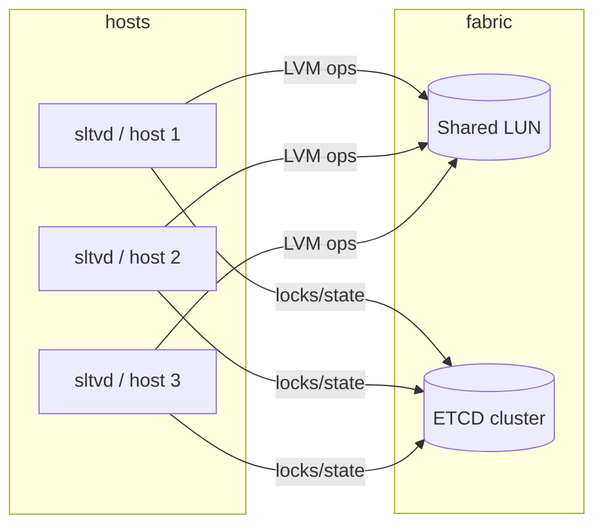

# Clustering with ETCD

SLTV runs comfortably in standalone mode on a single hypervisor, but
its real value emerges when several hosts share one Volume Group on
FC/iSCSI LUNs. In that mode the hosts coordinate metadata operations
through ETCD and use the same store as the source of truth.

## Storage model

Every host sees the same VG (`vg-shared`, by convention) over a
shared LUN. LVM2 itself does not provide cluster locking; instead,
SLTV serialises all VG-mutating operations through an ETCD
distributed mutex.



Two locks must be respected:

1. **Per-VG mutex** at `<prefix>/locks/vg/<vg>`, implemented with
   `etcd.concurrency.NewMutex`. All operations that mutate LVM
   metadata (`lvcreate`, `lvextend`, `lvremove`) must hold this lock.
2. **Per-attachment record** at `<prefix>/attachments/<disk>/<vm>`.
   `Create*Attachment` is atomic via an etcd Txn that fails if the
   record already exists.

Records under `<prefix>/disks/<name>` and `<prefix>/attachments/...`
are JSON, so you can inspect them directly with `etcdctl`:

```bash
etcdctl get --prefix /sltv/
```

## Membership

Each `sltvd` registers itself at `<prefix>/nodes/<node_id>` with the
session lease attached. The TTL is configured by `cluster.etcd.lock_ttl`.
If a node crashes the lease eventually expires, freeing both the
membership entry and any held mutexes.

`sctl status --cluster` lists known peers and the catalog counts.

## Failure modes

| Failure | Effect |
| --- | --- |
| Single host crashes mid-`lvextend` | The ETCD session expires after `lock_ttl`. Other hosts can then acquire the lock; `lvextend` is idempotent against the on-disk state, so reissuing the request is safe. |
| ETCD cluster loses quorum | All `Acquire` calls block; outstanding leases stop being refreshed. The daemon does not perform mutating LVM ops until quorum returns. Read-only RPCs that don't touch the lock continue to work. |
| Network partition | The minority side cannot acquire the lock and effectively becomes read-only for shared-VG operations. |
| Stale local cache | The daemon does not cache aggressively; ETCD is the source of truth. After a brief partition, `ListDisks` reflects the up-to-date view as soon as ETCD is reachable. |

## Bootstrapping

1. Build the ETCD cluster (3 nodes is the smallest sensible size).
2. Configure each host's `sltvd.yaml` with `cluster.enabled: true`
   and the same set of endpoints.
3. Pick one host to run `pvcreate /dev/sd...` and `vgcreate vg-shared
   /dev/sd...` against the shared LUN. The other hosts will see the
   VG after `vgscan --cache`.
4. `systemctl enable --now sltvd` on every host.

The Vagrant-based test bed in `test/e2e/vagrant/` automates all of
this; see [docs/testing.md](testing.md).

## TLS to ETCD

Configure `cluster.etcd.tls.{cert,key,ca}` to talk to a hardened ETCD
cluster. The same paths can be used for sltvd's own TCP listener (see
[docs/configuration.md](configuration.md)).
