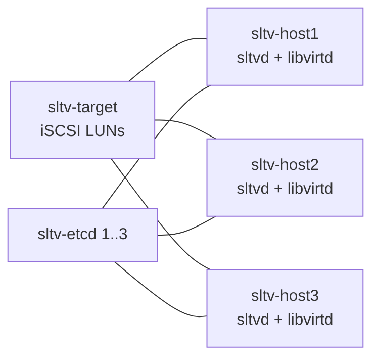

# Testing

SLTV ships three layers of automated tests. They are progressively
more expensive to run and progressively more realistic.

## Unit tests

Run them on any platform with a recent Go toolchain:

```bash
make test
```

The `make test` target runs `go test ./...` across every package.
All host interactions (LVM, libvirt, ETCD, BoltDB) sit behind
interfaces, so the unit suite has no external dependencies. The
`internal/server` tests spin up an in-process gRPC server over a
`bufconn` listener; the `internal/disk` and `internal/thin` tests
use the in-memory store and fake LVM/libvirt clients.

`make lint` runs `golangci-lint` with the configuration in
[.golangci.yml](../.golangci.yml).

## Integration tests

Some tests rely on real OS components. They are gated by environment
variables so the default `make test` invocation stays portable.

| Variable | Enables | Requirements |
| --- | --- | --- |
| `SLTV_TEST_ETCD=<endpoints>` | `internal/cluster` end-to-end test against a real ETCD cluster. | Reachable ETCD; comma-separated endpoint list. |
| `SLTV_TEST_LVM=1` | (Planned) Loopback-backed LVM test that exercises the real `lvm2` binaries. | Linux host with `lvm2` and `losetup`. |
| `SLTV_TEST_LIBVIRT=qemu:///system` | (Planned) Libvirt smoke tests. | Running libvirtd, permissive policy. |

The current set of integration scaffolding lives in
[`test/integration/`](../test/integration/); the README there lists
which scenarios are wired up today and which are intended next steps.

## End-to-end test bed (Vagrant)

A complete multi-host environment for SLTV is automated in
[`test/e2e/vagrant/`](../test/e2e/vagrant/). It provisions:

- `sltv-target`: an iSCSI target exporting two 10 GiB LUNs.
- `sltv-etcd1..3`: a 3-node ETCD cluster.
- `sltv-host1..3`: three KVM hypervisors running `sltvd` against the
  shared LUNs and the ETCD cluster, with nested virtualisation
  enabled so the hosts can boot guest VMs.



### Bringing it up

```bash
cd test/e2e/vagrant
vagrant up
```

The provisioning scripts (in `test/e2e/vagrant/scripts/`):

1. Set up the iSCSI target and discover the LUNs from each host.
2. Install ETCD on the etcd nodes and form a cluster.
3. On every host install libvirt/KVM, log into the iSCSI portal,
   build SLTV from source, install the systemd unit, and start
   `sltvd` in cluster mode.
4. Host 1 runs `pvcreate` and `vgcreate vg-shared` so the other
   hosts see the same VG.

### Scenarios

[`test/e2e/vagrant/run-scenarios.sh`](../test/e2e/vagrant/run-scenarios.sh)
contains example scripts you can run with
`vagrant ssh sltv-host1 -c './run-scenarios.sh'`. They cover:

- Parallel `create-disk` from two hosts to verify lock contention.
- `list-disks` on a third host to verify cluster state replication.
- A long-running `dd` inside a guest backed by a thin disk to
  trigger the auto-extend loop, with `sctl get-disk` calls in another
  shell to watch the LV grow.
- Hard-rebooting `sltv-host1` while it holds a VG lock and verifying
  the other hosts continue to operate after the lease expires.

### Tear-down

```bash
vagrant destroy -f
```

The `Vagrantfile` is intentionally idempotent so you can iterate on a
single host (e.g. `vagrant reload sltv-host1 --provision`) without
rebuilding the rest of the environment.
